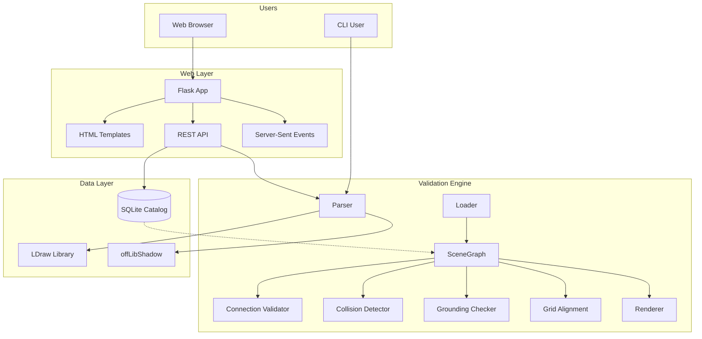
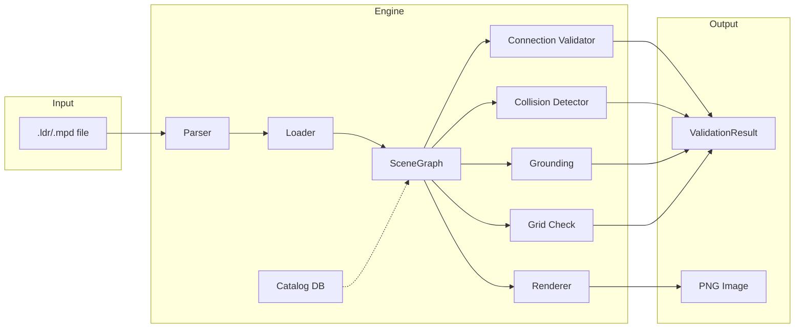
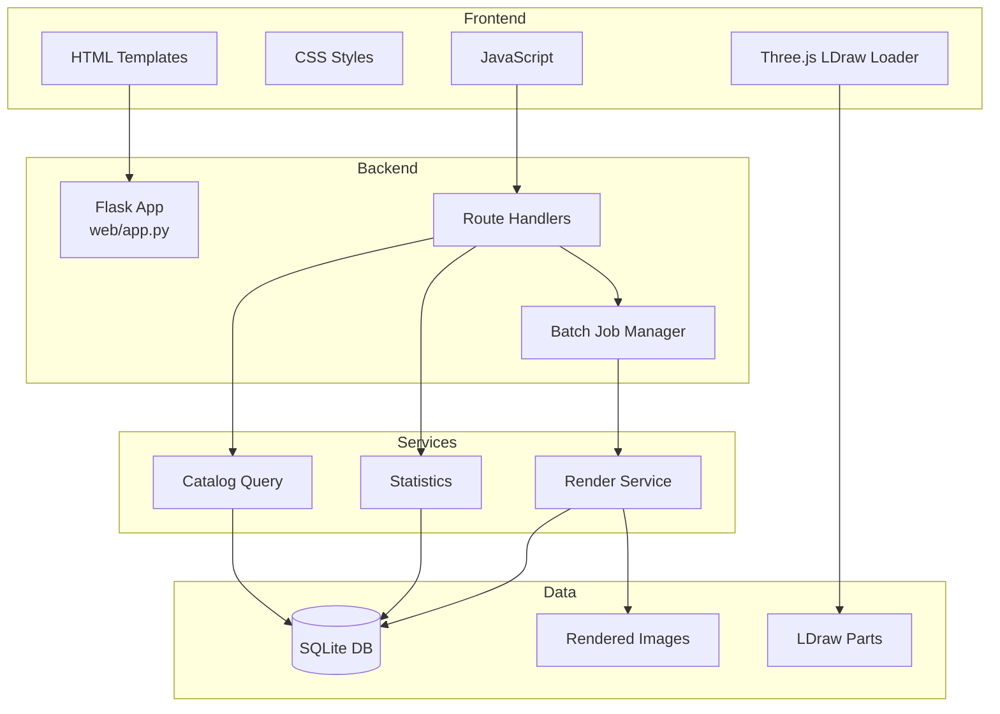
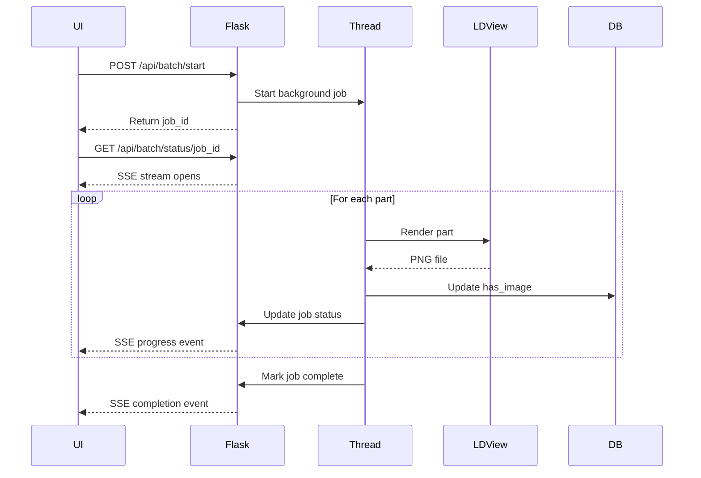

# Architecture Overview

This document describes the technical implementation of the LDraw Validator, including both the core validation engine (Phase 0) and the web interface.

## System Overview



## Core Validation Engine

### Component Diagram



## Key Components

### Catalog Database (`catalog_db.py`)
SQLite database containing 12,659 LDraw parts with extracted connection metadata.

**Key data structure:**
```python
@dataclass
class PartInfo:
    part_id: str
    part_name: str
    type: str                          # "Brick", "Plate", "Tile", etc.
    category: str | None               # LDraw !CATEGORY metadata
    ldraw_org: str                     # "Part", "Shortcut", "Primitive"
    height: float
    bounds: dict[str, tuple[float, float]]
    studs: list[list[float]]           # [[x, y, z], ...]
    anti_studs: list[list[float]]
    technic_holes: list[list[float]]
    connection_points: list[dict]      # offLibShadow connections
    connection_types: list[str]        # ["SNAP_CYL", "TUBE", ...]
    extraction_status: str             # "success", "partial", "failed"
    metadata: list[str]                # !HISTORY, !LICENSE, etc.
    subparts: list[str]                # Parts this part references
    parents: list[str]                 # Parts that reference this
```

**Database location:** `src/validator/data/catalog.db`

**Building the catalog:**
```bash
python scripts/build_catalog.py
```

This extracts connection points using two methods:
1. **Geometric detection**: Finds `stud.dat`, `stud2.dat`, etc. primitives
2. **offLibShadow parsing**: Reads explicit connection metadata from shadow library

### SceneGraph (`scene_graph.py`)
Maintains a list of placed bricks with 3D R-tree spatial indexing for efficient queries.

**Key operations:**
- `add_placement(Placement)` - Insert brick, index AABB
- `query_box(min, max)` - Find intersecting bricks
- `query_point(pt, tol)` - Find bricks near a point

**Placement data structure:**
```python
@dataclass
class Placement:
    part_id: str
    color: int
    position: tuple[float, float, float]
    rotation: tuple[float, ...]  # 3x3 matrix flattened to 9 floats
```

### Parser (`parser.py`)
Parses LDraw `.ldr` and `.mpd` files into structured data.

**Supported line types:**
- Line 0: Comments and meta-commands
- Line 1: Part reference (placement)
- Lines 2-5: Geometric primitives (ignored for validation)

**Key function:**
```python
def parse_ldraw(file_path: Path) -> dict[str, list[Placement]]:
    """Parse LDraw file, return dict of model_name -> placements."""
```

### Loader (`loader.py`)
Handles MPD submodel resolution and transform composition.

**Transform composition:**
```
World_Pos = Parent_Pos + (Parent_Rot × Local_Pos)
World_Rot = Parent_Rot × Local_Rot
```

Recursively resolves submodel references and flattens hierarchy into a single scene graph.

### Connection Validator (`connections.py`)
Matches studs to anti-studs between placed bricks.

**Algorithm:**
1. Transform local connection points to world coordinates
2. Query SceneGraph for nearby bricks
3. Match studs to anti-studs within tolerance:
   - Position: 0.5 LDU (configurable)
   - Height: 4 LDU vertical offset
4. Build connectivity graph: List[(brick_i, brick_j)]

**Connection types supported:**
- Stud to anti-stud (standard LEGO connection)
- offLibShadow connection points (SNAP_CYL, TUBE, etc.)

### Grounding Checker (`grounding.py`)
Verifies all bricks are connected to the build plate.

**Algorithm:**
1. Identify ground-touching bricks (Y ≈ 0 with anti-studs facing down)
2. Breadth-first search through connectivity graph
3. Mark all reachable bricks as grounded
4. Report ungrounded bricks as errors

**Key function:**
```python
def validate_grounding(
    placements: list[Placement],
    connections: list[tuple[int, int]]
) -> tuple[bool, list[int]]:
    """Returns (is_grounded, floating_brick_indices)."""
```

### Collision Detector (`collision.py`)
Detects illegal brick overlaps.

**Two-phase approach:**

1. **Broad phase**: R-tree AABB intersection query
   - O(n log n) complexity
   - Finds candidate collision pairs

2. **Narrow phase**: Shrink AABBs by 2 LDU tolerance
   - Allows face-touching without false positives
   - Accounts for LEGO clutch power

**Rationale for AABB (not OBB):**
- Simpler implementation
- Sufficient for System bricks (mostly rectangular)
- Fast with spatial indexing

### Grid Alignment Checker (`checks.py`)
Validates brick positions align to LEGO grid.

**LEGO grid:**
- Stud spacing: 20 LDU (1 stud width)
- Plate height: 8 LDU (1/3 brick height)
- Brick height: 24 LDU

**Checks:**
- X/Z position multiples of 20 LDU
- Y position multiples of 8 LDU
- Warns on misalignment (doesn't fail validation)

### Renderer (`renderer.py`)
Generates PNG images via LDView subprocess.

**LDView command:**
```bash
LDView.exe model.ldr -SaveSnapshot=output.png -SaveWidth=800 -SaveHeight=600
```

**Features:**
- Automatic camera positioning
- Configurable resolution
- Silent error handling for batch rendering

### Shadow Parser (`shadow_parser.py`)
Parses offLibShadow connection metadata.

**offLibShadow format:**
```ldraw
0 !LDCAD SNAP_INCL [gender=M] [caps=one] [secs=R 6 4]
```

**Extracted data:**
- Connection type (SNAP_CYL, TUBE, etc.)
- Gender (M/F for male/female)
- Role (connector, receptor)
- Properties (dimensions, constraints)

This provides explicit connection metadata where geometric detection fails.

## Web Interface

### Architecture



### Flask Application (`web/app.py`)

**Key routes:**

```python
# Pages
@app.route('/')                    # Catalog browser
@app.route('/stats')               # Statistics dashboard
@app.route('/batch')               # Batch rendering interface

# API - Catalog
@app.route('/api/parts')           # Paginated part list with filters
@app.route('/api/parts/<id>')      # Part detail
@app.route('/api/stats')           # Catalog statistics
@app.route('/api/distributions')   # Data distributions for charts

# API - Rendering
@app.route('/api/parts/<id>/render', methods=['POST'])
@app.route('/api/images/<id>.png') # Serve rendered images

# API - Batch Processing
@app.route('/api/batch/start', methods=['POST'])
@app.route('/api/batch/status/<job_id>')  # SSE stream
@app.route('/api/batch/stop/<job_id>', methods=['POST'])

# LDraw File Serving (for 3D viewer)
@app.route('/parts/<path>')
@app.route('/p/<path>')            # Primitives
```

### Catalog Browser

**Features:**
- Multi-select filters (category, type, extraction status, etc.)
- Search by part ID or name
- Pagination (50 parts per page)
- On-demand image rendering
- 3D viewer modal

**Filter implementation:**
```python
# Frontend sends comma-separated values
GET /api/parts?categories=Brick,Plate&images=yes&page=1

# Backend builds dynamic SQL query
WHERE category IN ('Brick', 'Plate') AND has_image = 1
LIMIT 50 OFFSET 0
```

### Statistics Dashboard

**Visualizations:**
- Pie charts for categorical distributions
- Histograms for numeric distributions
- Summary cards with key metrics

**Data sources:**
```python
GET /api/distributions
# Returns:
{
  "category": {"type": "categorical", "values": [...]},
  "height": {"type": "numeric", "values": [...], "min": ..., "max": ...},
  ...
}
```

Charts rendered client-side using Chart.js (or similar).

### Batch Rendering System

**Architecture:**



**Key features:**
- Background threading (non-blocking)
- Real-time progress via Server-Sent Events
- Start/stop control
- Job history tracking
- Error handling and logging

**Job state:**
```python
{
    "id": "uuid",
    "status": "running",  # or "completed", "stopped"
    "total": 100,
    "completed": 47,
    "success": 45,
    "failed": 2,
    "current": "3001.dat",
    "log": ["✓ 3001.dat", "✗ 3002.dat: render failed", ...],
    "filters": "categories:Brick,Plate"
}
```

### 3D Viewer

**Implementation:**
- Three.js with LDraw loader extension
- Client-side rendering (WebGL)
- Orbit controls for rotation/zoom
- Loads parts directly from LDraw library

**Backend support:**
```python
@app.route('/parts/<filename>')
def serve_ldraw_parts(filename):
    # Serves .dat files from C:\LDraw\ldraw\parts
    return send_file(ldraw_path / filename, mimetype='text/plain')
```

**Frontend:**
```javascript
const loader = new LDrawLoader();
loader.load('/parts/3001.dat', (group) => {
    scene.add(group);
    renderer.render(scene, camera);
});
```

### Database Connection Management

**Thread-safe pattern:**
```python
def get_db():
    """Get database connection for current request (thread-safe)."""
    if 'db' not in g:
        g.db = init_db()
    return g.db

@app.teardown_appcontext
def close_db(error):
    db = g.pop('db', None)
    if db is not None:
        db.close()
```

Each Flask request gets its own SQLite connection, avoiding threading issues.

## Data Flow

### Validation Flow

```
LDraw File → Parser → Models dict → Loader → SceneGraph
                                        ↓
                        ┌───────────────┼───────────────┐
                        ↓               ↓               ↓
                   Collisions    Connections      Grounding
                        ↓               ↓               ↓
                   Errors[]      Graph BFS        Floating[]
                        └───────────────┼───────────────┘
                                        ↓
                                ValidationResult
```

### Web Request Flow

```
Browser → Flask Route → Database Query → JSON Response → Frontend Render
          ↓
    (Optional) Validation Engine Call
          ↓
    Update Database → Respond
```

### Catalog Build Flow

```
LDraw Library → Part Files → Geometric Extraction → PartInfo
                    ↓              ↓
                Shadow Files → Shadow Parser → Connection Points
                                                     ↓
                                            SQLite Database
```

## Design Decisions

| Decision | Rationale |
|----------|-----------|
| AABB collision (not OBB) | Simpler, sufficient for System bricks |
| 2 LDU shrink tolerance | Allows face-touching without false positives |
| R-tree (not octree) | Built-in Python library, good enough for <1000 parts |
| SQLite catalog | Self-contained, no server needed, fast for reads |
| Server-Sent Events for batch | Simpler than WebSockets for one-way streaming |
| Flask over FastAPI | Easier templating, sufficient performance for catalog browsing |
| Three.js LDraw loader | Mature library, wide browser support |
| Background threads (not async) | Simpler for CPU-bound rendering tasks |

## Performance Characteristics

### Validation Engine

- **Loading**: O(n) where n = placements
- **Collision broad phase**: O(n log n) via R-tree
- **Connection matching**: O(s × log n) where s = total studs
- **Grounding BFS**: O(n + e) where e = connections
- **Memory**: ~1KB per placement + R-tree overhead

**Benchmarks:**
- 500-piece MOC: ~6ms average
- 1000-piece MOC: ~15ms estimated

### Web Interface

- **Catalog query**: <10ms for 50 parts with filters
- **Statistics aggregation**: ~50ms for full dataset
- **Image serving**: <5ms (static file)
- **LDView rendering**: 200-500ms per part
- **Database size**: ~50MB for 12,659 parts

### Catalog Building

- **Full rebuild**: 2-5 minutes
- **Geometric extraction**: ~100 parts/second
- **Shadow parsing**: ~500 parts/second
- **Database writes**: Batched for efficiency

## Technology Stack

### Core Engine

- **Language**: Python 3.10+
- **Key Libraries**:
  - `rtree`: R-tree spatial indexing
  - `sqlite3`: Database (stdlib)
  - `dataclasses`: Data structures
  - `pathlib`: File handling

### Web Interface

- **Backend**: Flask 3.1
- **Database**: SQLite 3
- **Frontend**: 
  - HTML5/CSS3
  - Vanilla JavaScript (no framework)
  - Three.js for 3D rendering
  - Chart.js (optional, for stats)
- **Communication**:
  - REST API (JSON)
  - Server-Sent Events (batch progress)

### External Dependencies

- **LDraw Library**: Official part definitions
- **LDView**: Command-line renderer
- **offLibShadow**: Connection metadata library

## Security Considerations

### Web Interface

- **Input validation**: Part IDs sanitized before database queries
- **Path traversal**: LDraw file serving restricted to library directory
- **SQL injection**: Parameterized queries throughout
- **DoS prevention**: Batch rendering limited to reasonable part counts
- **No authentication**: Currently single-user desktop application

**Future considerations for production:**
- Rate limiting
- User authentication
- API key management
- HTTPS enforcement

## Extensibility

### Adding New Validation Checks

1. Implement check in `checks.py` or new module
2. Call from `validate_moc()` in `__init__.py`
3. Add error type to `ValidationError`
4. Write unit tests

### Adding New Connection Types

1. Update `PartInfo` to store new connection data
2. Modify `build_catalog.py` to extract new type
3. Update `connections.py` matching logic
4. Add test cases

### Adding New Web Features

1. Add route handler in `web/app.py`
2. Create template in `web/templates/`
3. Update navigation in `base.html`
4. Add API endpoints as needed

## Future Enhancements

### Phase 1: Synthetic Dataset Generation
- Generate valid/invalid MOC combinations
- Use validation engine to label training data
- Export dataset for ML training

### Phase 2: ML Integration
- Discriminative models (brick detection from images)
- Generative models (MOC creation from prompts)
- Use validator as fitness function

### Technical Debt
- [ ] Fix 8 failing tests (grounding detection edge cases)
- [ ] Add authentication to web interface
- [ ] Implement catalog incremental updates (vs full rebuild)
- [ ] Add API documentation (OpenAPI/Swagger)
- [ ] Performance profiling for large MOCs (>1000 parts)
- [ ] Support for Technic connections (pins, axles)
- [ ] SNOT (Studs Not On Top) validation

---

**Last Updated:** 2026-02-06
