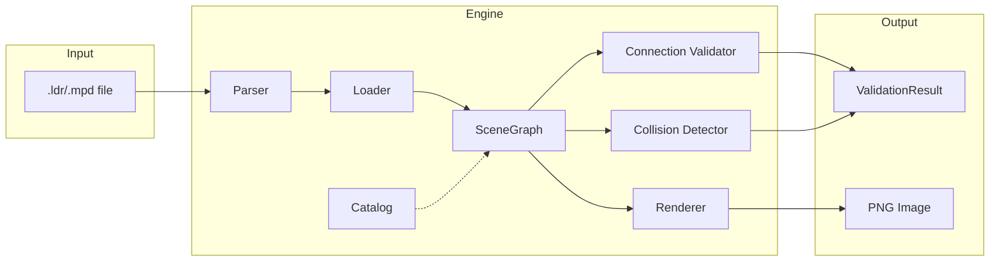

# Architecture Overview

This document describes the technical implementation of the LDraw Validator (Phase 0).

## Component Diagram



## Key Components

### Catalog (`catalog.py`)
Extracts connection points (studs, anti-studs) from LDraw part files by detecting `stud*.dat` primitives. Uses pickle caching for performance.

**Key data structure:**
```python
@dataclass
class PartInfo:
    name: str
    studs: list[tuple[float, float, float]]
    height: float
    bounds: dict[str, tuple[float, float]]
    anti_studs: list[tuple[float, float, float]]
```

### SceneGraph (`scene_graph.py`)
Maintains a list of placed bricks with 3D R-tree spatial indexing for efficient queries.

**Key operations:**
- `add_placement(Placement)` - Insert brick, index AABB
- `query_box(min, max)` - Find intersecting bricks
- `query_point(pt, tol)` - Find bricks near a point

### Loader (`loader.py`)
Handles MPD submodel resolution and transform composition:
```
World_Pos = Parent_Pos + (Parent_Rot × Local_Pos)
World_Rot = Parent_Rot × Local_Rot
```

### Connection Validator (`connections.py`, `grounding.py`)
1. Transform local studs to world coordinates
2. Query SceneGraph for nearby anti-studs
3. Match within tolerance (0.5 LDU position, 4 LDU height)
4. Build connectivity graph, BFS from ground (Y ≈ 0)

### Collision Detector (`collision.py`)
- **Broad phase**: R-tree AABB intersection
- **Narrow phase**: Shrink AABBs by 2 LDU to allow legal adjacency

### Renderer (`renderer.py`)
Shells out to LDView via subprocess:
```bash
LDView.exe model.ldr -SaveSnapshot=output.png -SaveWidth=800
```

## Design Decisions

| Decision | Rationale |
|----------|-----------|
| AABB collision (not OBB) | Simpler, sufficient for System bricks |
| 2 LDU shrink tolerance | Allows face-touching without false positives |
| R-tree (not octree) | Built-in Python library, good enough for <1000 parts |
| Pickle cache | Fast catalog reload, ~30 parts in <1ms |

## Data Flow

```
LDraw File → Parser → Models dict → Loader → SceneGraph
                                        ↓
                        ┌───────────────┼───────────────┐
                        ↓               ↓               ↓
                   Collisions    Connections      Renderer
                        ↓               ↓               ↓
                   Errors[]      Grounding BFS     PNG file
                        └───────────────┼───────────────┘
                                        ↓
                                ValidationResult
```

## Performance Characteristics

- **Loading**: O(n) where n = placements
- **Collision broad phase**: O(n log n) via R-tree
- **Connection matching**: O(s × log n) where s = total studs
- **Memory**: ~1KB per placement + R-tree overhead
